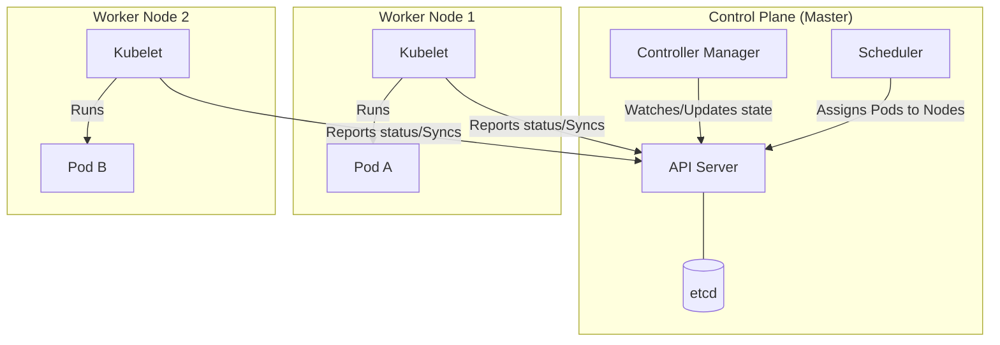
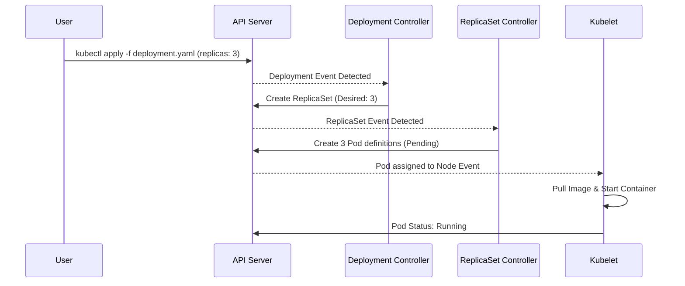
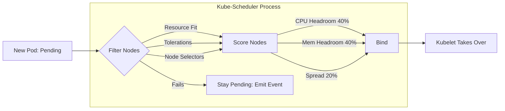
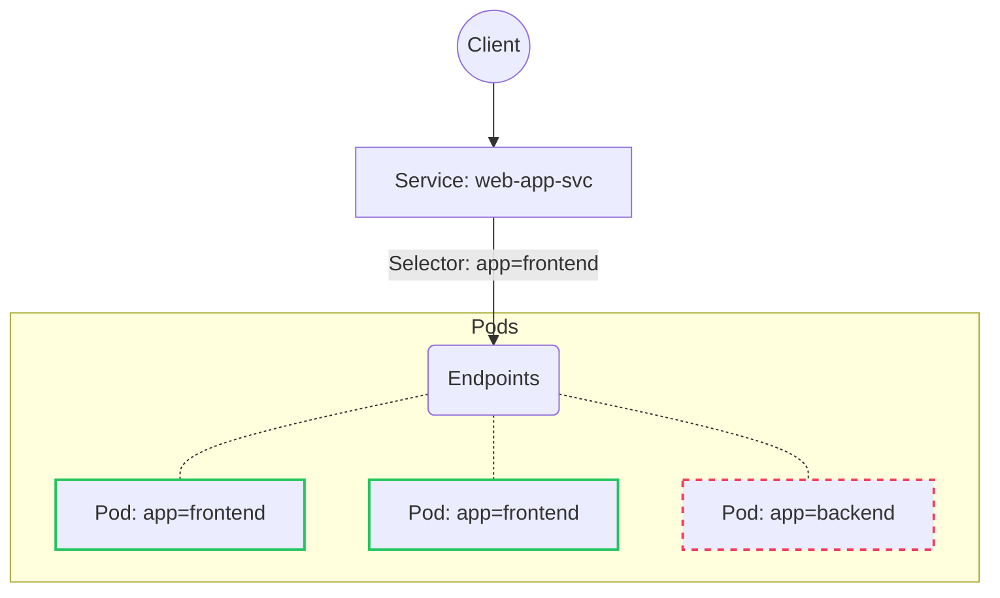
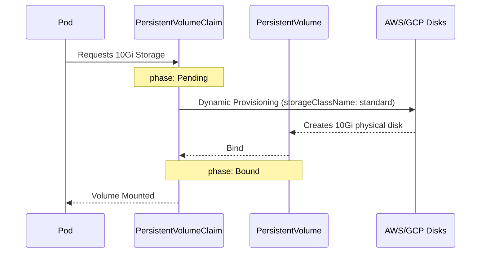

# The Kubernetes Simulator Learning Path

Welcome to the **Kubernetes Simulator**, a visual, fully interactive replica of the Kubernetes Control Plane. This document is your chronological syllabus. It shows you how to use this application to transition from theoretical knowledge to building **deep mechanical intuition** about how Kubernetes operates, breaks, and recovers.

By following this guide, you will be prepared to tackle the CKA/CKS exams and handle real-world production outages without blindly relying on Google.

---

## 🟢 Part 1: First Steps & The Core Control Loop (Beginner)
*The goal of this phase is to stop thinking of Kubernetes as a magical container runner, and instead understand it as a continuous reconciliation loop.*

### Lesson 1.1: The Anatomy of a Cluster
1. **Action in Simulator:** Open the **Overview** module.
2. **Observe:** You will see a `Control Plane` node and two `Worker` nodes. 
3. **Concept to Learn:** Kubernetes relies on the *apiserver* as the central brain. The worker nodes run *kubelets* that constantly ask the apiserver "What should I be running?"
4. **Experiment:** In the terminal, type `kubectl get nodes`. Notice how the simulation accurately reflects the `Ready` status and capacity.

### Lesson 1.2: Pods vs. Workloads (Reconciliation)
1. **Action in Simulator:** Open the **Workloads** module.
2. **Experiment:** Scale a Deployment up to 3 replicas. Watch the UI immediately spawn 3 Pods. 
3. **Concept to Learn:** Never create naked Pods. You create a Deployment, which creates a ReplicaSet, which creates the Pods. This is the reconciliation loop in action.

4. **Break It:** Manually delete one of the Pods in the UI (or type `kubectl delete pod <name>`). 
5. **Watch the Engine:** The simulator will instantly notice the ReplicaSet desired state (3) doesn't match reality (2), and will automatically generate a new Pod. *This is Kubernetes' most important feature.*

---

## 🟡 Part 2: Scheduling & Basic Failure Modes (Intermediate)
*The goal of this phase is to understand why a Pod runs on a specific Server, and why it sometimes refuses to run at all.*

### Lesson 2.1: The "Filter & Score" Matrix
1. **Concept to Learn:** The `kube-scheduler` puts Pods on Nodes. It first *Filters* out bad candidates and then *Scores* the remaining nodes to find the best fit.

2. **Action in Simulator:** Go to the **Scenarios** library. Load the `Pending Pod — Insufficient Resources` scenario.
3. **Diagnose:** Type `kubectl describe pod <name>`. See how the events tab outputs exactly: `0/2 nodes are available: 2 Insufficient cpu`.
4. **Solve It:** Use the YAMLEditor to lower the pod's requested CPU limits. Watch the scheduler successfully bind the pod.

### Lesson 2.2: Taints and Tolerations
1. **Action in Simulator:** Load the `Pending Pod — Taint/Toleration Mismatch` scenario.
2. **Concept to Learn:** Taints are locks on a Node. Tolerations are keys on a Pod. If a node is tainted `gpu=true:NoSchedule`, a normal pod cannot land there.
3. **Solve It:** Open the terminal. Type `kubectl describe node node-1` and find the active taints. Apply a Toleration to the deployment YAML to match the taint. You will get the 🎉 **Scenario Solved!** banner.

### Lesson 2.3: The Classic Bug (CrashLoopBackOff)
1. **Action in Simulator:** Load the `CrashLoopBackOff` scenario.
2. **Observe:** The pod continuously dies and restarts. The backoff delay between restarts increases exponentially.
3. **Concept to Learn:** Exit codes matter. Exit code `1` is an application error. Exit code `137` means OOMKilled by Linux limits.
4. **Solve It:** Use the terminal: `kubectl logs <pod-name> --previous` to see why the last iteration crashed.

---

## 🟠 Part 3: Networking & High Availability (Intermediate)

### Lesson 3.1: Services and the Selector Pattern
1. **Action in Simulator:** Load the `Service Selector Mismatch` scenario.
2. **Concept to Learn:** Services bind to Pods dynamically using pure **Label matching**.

3. **Diagnose:** In the terminal, run `kubectl get endpoints`. Notice it returns `<none>`. 
4. **Solve It:** Match the `selector` block in the Service YAML exactly to the `labels` block in the Deployment template.

### Lesson 3.2: Evictions and Node Failures
1. **Action in Simulator:** Go to **Overview** and click "Kill Node" on `node-1`.
2. **Observe:** The node status becomes `NotReady`. 
3. **The Simulation Engine:** After the ~40 second grace period, Kubernetes forcefully Evicts the stranded pods, and the Scheduler recreates them on healthy nodes. Always run replicas > 1 for HA!

---

## 🔴 Part 4: Advanced Stateful Mechanisms (Advanced)

### Lesson 4.1: Volume Provisioning & Mounting
1. **Action in Simulator:** Load the `PVC Stuck in Pending` scenario.
2. **Concept to Learn:** How ephemeral pods permanently save data using PVC and PV bindings.

3. **Solve It:** Change the `storageClassName` to `standard` in the YAML editor to trigger dynamic provisioning.

### Lesson 4.2: StatefulSets & DaemonSets
1. **Observation:** Apply a `StatefulSet`. Watch it strictly generate `pod-0`, wait for it to be `Ready`, then generate `pod-1`.
2. **Observation:** Apply a `DaemonSet`. It bypasses the Scheduler and strictly ensures exactly 1 replica exists on every single eligible node.

---

## 🏆 Part 5: Complete The Final Scenarios (CKS Focus)
Put your skills to the test by solving the remaining active scenarios without using the hints:

* **Rolling Update Stuck:** Why is my replacement hanging? (Hint: Check the Readiness Probe and `maxUnavailable` settings).
* **NetworkPolicy Blocking Traffic:** How do I allow `frontend` pods to talk to `backend` pods while denying everything else?
* **HPA Not Scaling:** My CPU is melting, but my Autoscaler is stuck at `<unknown>`. (Hint: Install the `metrics-server`!).

### The Capstone
If you can clear all **12 scenarios** in the Simulator Library, receiving the green **🎉 Scenario Solved!** banner for each, you possess strong mechanical empathy for debugging Kubernetes clusters! Use the **Time Travel Debugger** to replay your failures and watch exactly when the controllers detected your fixes.
